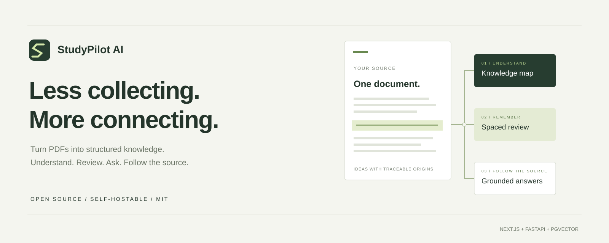

<p align="center"></p>

# StudyPilot AI

一个以本地运行为优先的开源 AI 学习助手：将 PDF 阅读、中英对照翻译、知识整理、复习练习和常用文件转换放在同一个工作区。

**默认中文 / English · PDF 对照翻译 · 本地格式转换 · 带出处的问答 · 学习计划与自测**

下载代码、安装依赖并启动后，在自己的浏览器中使用。**不需要购买域名、云服务器或云数据库；本仓库目前不提供公共在线体验服务。** 内置演示不需要 AI 密钥，使用自己的 PDF 生成学习内容则需要自行配置模型。

**当前桌面版本：v1.1.0。** Windows 安装包只有在自动化检查、生产构建、实际安装与重启验证全部通过后才会进入 GitHub Releases。真实付费模型的回答质量、全部 Windows 设备和长期使用稳定性仍需持续验证；这是本地优先的开源应用，不是托管在线服务。

项目由嘉兴大学通信专业学生 **“爱吃孜然芥末”** 独立制作；该身份说明不代表嘉兴大学官方开发、授权或背书。使用问题请联系 `2014546082@qq.com`。

[快速开始](#快速开始) · [API 接入](#api-接入主流模型) · [阅读布局](#阅读布局与悬浮助手) · [论文翻译](#pdf-中英对照翻译) · [格式转换](#本地格式转换) · [中英文切换](#中英文切换) · [配置模型](#demo-与真实模型) · [验证状态](#当前验证状态) · [MIT](LICENSE)

## 不止是一个聊天窗口

| 工作环节 | 当前实现                                                                                       |
| -------- | ---------------------------------------------------------------------------------------------- |
| 阅读     | PDF 上传、异步处理、分页阅读、文本视图、原文关键词搜索                                         |
| 翻译     | 中英目标语言、学术/易读风格、术语偏好、逐段对照、分批翻译和 TXT 导出；需要真实聊天模型         |
| 转换     | 图片转 PDF、PDF 转图片、PNG/JPG/WebP 互转、PDF 提取 TXT；浏览器本地处理，无需 AI               |
| 理解     | 章节与知识点树，重要程度、难度、摘录和来源页码；自有 PDF 需要模型                              |
| 问答     | 可切换 19 类主流云端/本地模型，跨语言检索词 + 本地关键词检索、原文引用；保留原有 pgvector 模式 |
| 复习     | 按时间容量安排学习计划、任务勾选、闪卡与间隔复习                                               |
| 自测     | 选择题、判断题、简答题，以及带出处的答题反馈                                                   |
| 控制     | 中英文切换、浅色/深色主题、固定悬浮导航、API 接入与型号管理、文档管理                          |

页面包括产品首页、学习仪表盘、文档库、PDF 学习工作区、复习计划、学习工具箱、API 接入、设置、隐私说明和开源说明。内置样例可以演示阅读、问答、计划、闪卡和测验的完整流程；原有 Demo 使用固定内容，不代表真实模型的生成效果，也不会模拟 AI 翻译。

## 快速开始

### Windows 桌面安装版

桌面版安装包通过 [GitHub Releases](https://github.com/ZZZ234234234/study-pilot-ai/releases) 分发。**只有在发布页实际列出 `.exe` 附件时，才表示该版本已完成构建发布**；源码 ZIP 不是安装包。

下载 `StudyPilot-AI-1.1.0-Windows-x64-Setup.exe` 后安装，通过桌面快捷方式启动，不需要另装 Node、Python 或数据库。AI 问答和翻译仍需在应用的「API 接入」中填写自己的服务商密钥；Ollama、LM Studio 可使用本机回环地址且默认不要求密钥。

资料保存在本机用户目录，与源码运行版及浏览器工作空间分开，不会自动导入旧资料。首版安装包未签名；API Key 当前保存在本地数据库，尚未使用系统凭据加密。详细构建与验收说明见 [桌面版文档](desktop/README.md)。

### 官方身份、防伪与维权

应用侧栏提供「真伪核验与维权说明」。正式安装包仅从本仓库 Releases 下载，并同时发布 `SHA256SUMS.txt`；v1.0.1 起，GitHub Actions 还会为安装包生成构建来源证明。可在安装包目录执行：

```powershell
certutil -hashfile "StudyPilot-AI-1.1.0-Windows-x64-Setup.exe" SHA256
gh attestation verify "StudyPilot-AI-1.1.0-Windows-x64-Setup.exe" -R ZZZ234234234/study-pilot-ai
```

第一条结果应与同一 Release 的 `SHA256SUMS.txt` 完全一致；第二条需要先安装 GitHub CLI。任一核验失败时不要安装。代码遵循 [MIT 许可证](LICENSE)，官方身份、名称与仿冒处理边界见 [TRADEMARKS.md](TRADEMARKS.md)。

### 从源码运行（开发者）

需要 **Node.js 22.13+、Python 3.11+**；以下克隆命令还需要 Git。首次运行需要联网安装依赖。默认使用随启动脚本运行的本地数据库，不必另外安装 PostgreSQL 或 Docker。

没有 Git，也可以在仓库页面点击 **Code → Download ZIP**，解压后在项目根目录打开终端，跳过下面的 `git clone` 和 `cd` 两行。首次安装请保留 `.env.example` 的默认 Demo 配置。

以下安装步骤用于全新目录；已有资料的用户请先看[更新说明](#已经在使用旧版)。

### Windows PowerShell

```powershell
git clone https://github.com/ZZZ234234234/study-pilot-ai.git
cd study-pilot-ai
Copy-Item .env.example .env
py -m venv .venv
.\.venv\Scripts\python.exe -m pip install -e "apps/api[dev]"
npm ci
.\.venv\Scripts\python.exe scripts/dev.py
```

如果 PowerShell 提示不能运行 `npm.ps1`，将命令中的 `npm` 换成 `npm.cmd`，例如 `npm.cmd ci`，无需为此修改系统执行策略。

### macOS / Linux

```bash
git clone https://github.com/ZZZ234234234/study-pilot-ai.git
cd study-pilot-ai
cp .env.example .env
python3 -m venv .venv
.venv/bin/python -m pip install -e "apps/api[dev]"
npm ci
.venv/bin/python scripts/dev.py
```

已安装 Make 时，也可使用 `make install` 和 `make dev`。

### 启动后访问

- 学习界面：<http://localhost:3000>
- 后端交互文档：<http://127.0.0.1:8000/docs>

等待终端显示服务启动成功，再打开学习界面。**保持这个终端运行**；按 `Ctrl+C` 停止服务。下次使用时只需在项目目录重新运行最后一条 Python 启动命令，不必重新复制配置或安装依赖。

`scripts/dev.py` 会启动仅供本地开发使用的 **PGlite + pgvector**、执行数据库迁移，并运行 API、后台处理进程和前端。开发数据库监听 `127.0.0.1:54329`，不要对公网开放。数据保存在 `data/`，重启后保留。

> `npm run dev` 只启动前端，不会启动 API 和数据库。完整项目请使用上面的 Python 启动脚本或 `make dev`。`localhost` 指当前这台电脑，不能把这个地址发给别人作为在线体验链接；本地开发服务也不应直接暴露到公网。

## 第一次使用

1. 打开学习界面，点击 **体验内置样例 / 添加样例**，等待资料处理完成。
2. 进入 PDF 学习工作区，阅读原文、查看知识点；试着提问“什么是反向传播？”，并点击回答中的引用核对来源。
3. 设置复习目标和可用时间，创建学习计划，再体验闪卡和测验。
4. 到 **设置 → 界面语言** 切换中文或 English；语言设置不需要模型密钥。
5. 上传自己的 PDF，先体验阅读和搜索。问答与翻译可直接在侧边栏 **API 接入** 中保存模型；知识地图与练习仍按[高级模型配置说明](#demo-与真实模型)操作。
6. 阅读英文论文时，进入文档中的 **对照翻译**；处理图片或格式时，打开左侧 **学习工具箱**。

默认接受 **20 MB 以内、最多 300 页**的未加密 PDF，可在服务端配置中调整。资料需要有可提取的文本；纯扫描件请先进行 OCR，当前项目不包含 OCR。

工作区通过浏览器 Cookie 识别，而不是可找回的登录账号。请固定使用同一个浏览器和地址，不要在 `localhost` 与 `127.0.0.1` 之间来回切换。清除 Cookie、更换浏览器或会话过期后，可能无法访问原工作区；这不表示磁盘上的资料自动删除。

## 中英文切换

**界面默认简体中文，在「设置 → 界面语言」中可切换 English，也可随时切回中文。** 导航、按钮、日期、状态、操作提示和常见错误跟随语言切换；中文输入法选字时按回车不会误发问题。

语言选择保存在当前浏览器，刷新后继续使用；若浏览器禁止本地存储，当前访问仍可切换，但下次打开可能恢复中文。不依赖浏览器或系统语言，也不需要配置 AI。切换不刷新页面、不重新处理文档，也不清空学习记录。偏好逻辑和双语静态渲染已通过测试，实际浏览器交互仍待完整回归。

文档原文、引用和已有学习记录不会被自动翻译；这项设置选择的是**界面语言**，不是全文翻译。品牌名称、模型名称、配置变量及必要的技术术语保留原样。

## 阅读布局与悬浮助手

阅读区优先展示资料，不再默认让 PDF 与问答各占一半：桌面默认约七成宽度用于 PDF，较小窗口会自动调整比例。手机默认显示 PDF，需要助手时再打开。

- **随时打开导航**：屏幕左边中部的半透明按钮固定在视口中，滚动后也能直接打开原有侧边栏。API 接入、系统设置和隐私入口集中在侧边栏。首次访问默认收起；手机使用抽屉菜单，点击遮罩、关闭按钮或按 Esc 退出。
- **阅读区上移**：缩短顶栏与标题区域，普通阅读工作区使用剩余视口高度；不再让整个文档与 AI 面板挤在页面下方。
- **全屏看资料**：点击 PDF 页面，或点击上方「全屏阅读」，进入浏览器页面内的全屏图像阅读模式。资料占满阅读区，已打开的助手自动悬浮；按 **Esc** 或「退出全屏」返回。不是新开窗口，也不会重新上传 PDF。
- **放大与翻页**：工具栏支持 50%—300% 缩放、翻页和「适应宽度」。100% 表示适应当前阅读区宽度，不是纸张的物理尺寸；放大后可以在阅读区横向、纵向滚动。普通模式仍提供文字视图和原始 PDF 下载。
- **隐藏或悬浮助手**：点击「隐藏助手」可把空间完全让给资料；「打开学习助手」恢复。助手标题栏右侧可切换「设为悬浮窗 / 停靠右侧」。全屏和手机模式使用悬浮助手。
- **移动和调整大小**：拖动悬浮窗标题栏移动整个助手，拖动右下角调整窗口大小；也可以聚焦相应手柄后使用方向键，按住 Shift 加大步幅。窗口会限制在可见范围内，位置不合适时点击「重置窗口位置」。停靠模式下可左右拖动分隔线调整两栏比例。

隐藏、悬浮、停靠和全屏切换保留当前 PDF 页码、未发送的问题以及当前文档内的译文；不会因此重新发起 AI 生成。**隐藏助手不等于停止已经发出的 AI 请求**，翻译任务需使用「停止后续页」停止后续请求。切换问答/翻译标签也保留草稿与译文，但刷新、离开文档后草稿和译文仍不会持久保存，译文请及时导出。

导航与助手布局偏好只保存到本机浏览器；窗口位置、窗口尺寸和分栏比例仅保留在当前文档会话。移动的是整个助手窗口，不会把历史回答重新排序。缩放时对 PDF 位图大小设有保护，极大页面会降低渲染像素密度以控制内存。上述交互有自动化组件测试，真实浏览器拖动、触屏、布局和辅助技术验收仍待完成。

## 更新与数据保留

### 已经在使用旧版？

如果最初通过 `git clone` 下载，先在运行窗口按 `Ctrl+C` 停止服务，备份自己的 `.env` 和整个 `data/` 文件夹，然后在项目目录执行 `git pull --ff-only`。依赖变更时，重新运行 `npm ci` 和对应系统的 Python 依赖安装命令，再按原方式启动项目。若有本地代码修改导致更新被拒绝，先保留修改，不要使用强制覆盖命令。

如果最初下载的是 ZIP，请将新版解压到新文件夹，不要直接覆盖旧目录。保留旧目录的 `.env`、`data/` 和浏览器资料；按上面的安装步骤准备新版，在服务停止时迁移自己的配置与数据，确认新版正常后再考虑处理旧目录。自定义 `DATA_DIR`、数据库地址或存储路径的部署需继续使用原配置。不要复制旧的 `node_modules` 或 Python 虚拟环境。

本次加入 `0002` 数据库迁移，新增私有模型配置、默认连接和回答型号字段；不删除旧资料和历史问答。**更新前备份完整数据**，再用原 Python 启动脚本启动，脚本自动执行迁移。若迁移报错，保留终端错误与备份，不要删除数据库重新开始。

更新源代码不会自动更新已经运行的进程。开发方式需要重启；使用生产构建时还需要重新运行 `npm run build`。Windows PowerShell 若拦截 npm 脚本，可用 `npm.cmd` 代替 `npm`。

## Demo 与真实模型

项目不附带共享 API 密钥或免费模型额度。你可以先用 Demo 了解流程，再自行选择是否配置真实模型；模型费用和本机运行资源由使用者承担。

默认 `AI_PROVIDER=demo`：

- 内置八页神经网络资料是项目原创的**英文样例**，随 MIT 许可证提供。
- 样例知识点是人工整理的固定英文内容；问答是确定性的原文摘录，不是大模型生成。常见中文概念（例如“卷积”“反向传播”“验证集”）有固定的英文关键词映射，方便中文提问；这不是通用翻译或语义理解，引用仍保留英文原文。
- 自己上传的 PDF 可以解析、阅读和搜索；未配置模型时，不会假装为其生成 AI 知识点和答案。

### API 接入：主流模型

1. 点击屏幕左侧中部的按钮展开导航，进入 **API 接入 → 添加模型**。
2. 从“中国大陆模型、国际模型、聚合平台、本地模型”中选择服务商；有多个区域时，再选择对应官方端点。
3. 填写连接备注名、自己的 **API Key** 和 **准确模型 ID**。Ollama、LM Studio 默认不要求密钥；同一服务商的不同型号可以分别保存，最多 30 个连接。
4. 支持模型目录接口的服务可点击 **读取可用模型列表**，其余服务提供文档参考型号或要求从控制台复制准确模型/推理接入点 ID。应用不会根据模糊名称静默替换型号；参考列表也不代表账号已经有调用权限。
5. 如需测试，勾选小额调用提示并点击 **检测连接与能力**。检测只发送一段随机令牌与临时映射规则，最多 160 个输出 token，不发送论文或历史对话；可能收费。结果分别显示接口与 JSON 输出、请求内上下文记忆和临时示例学习。检测完成仍需点击 **保存连接**。
6. 第一个连接自动成为默认，也可设置其他默认连接。保存立即生效，**不需要改 `.env`、重启服务或重新上传 PDF**。
7. 返回文档，在 **文档问答 / 对照翻译** 的模型选择器中选择已保存的连接。首次使用该连接需确认向服务商发送文本。

问答切换只影响后续问题；历史回答保留原来的备注名和准确型号，修改或删除连接也不会改写旧标签。已有问题草稿保留。默认连接用于新打开的文档；当前文档中的手动选择只保留在本次阅读会话。

**新接入范围是问答与翻译。** 问答会让所选模型生成中英检索词，再在本地按关键词查找原文片段，最后生成带出处的回答；这不是嵌入语义检索，长文中的单个问题通常最多两次模型调用，存在关键词漏检的限制。切换不会改动原来的向量索引。知识地图、闪卡与测验继续使用下面的高级服务端配置。

密钥由本项目后端存入当前 Cookie 工作空间的私有数据库，默认本地数据库位于 `data/`。**不覆盖全局 `.env`，不回传已保存的密钥，不写入浏览器持久存储或 Git。数据库并未静态加密**：请保护电脑、数据库和备份。换服务商必须重新填入对应密钥。删除连接不等于撤销服务商密钥，也不会自动清理旧备份。

当前配置目录覆盖：

| 类型         | 服务商                                                                                                 |
| ------------ | ------------------------------------------------------------------------------------------------------ |
| 中国大陆模型 | DeepSeek、智谱 AI、通义千问 / DashScope、Kimi / Moonshot、MiniMax、百度千帆、腾讯混元、豆包 / 火山方舟 |
| 国际模型     | OpenAI、Anthropic Claude、Google Gemini、xAI Grok、Mistral AI                                          |
| 聚合平台     | OpenRouter、SiliconFlow 硅基流动、GroqCloud、Together AI                                               |
| 本地模型     | Ollama、LM Studio                                                                                      |

云端服务只接受目录中预置的官方通用端点；本地模型只接受预置的回环地址。不支持任意自定义转发 URL、Coding Plan 专用地址、需要云厂商签名认证的 Bedrock，或资源地址因账号而变化的 Azure OpenAI。这样可以防止密钥被发送到伪造域名，也避免应用成为任意网络代理。适配器不跟随重定向、不读取系统代理配置、不自动重试收费请求；需要网络代理或私有网关的环境须另行评估部署方案。

“请求内上下文记忆”只表示模型能使用本次检测请求中提供的较早消息；“临时示例学习”只表示模型能在上下文内按新规则回答，**不等于训练、永久学习或形成用户画像**。本项目不实现跨对话长期记忆。

接口与参考型号核对日期：**2026-09-04**。配置窗口会提供所选服务商的官方文档和密钥入口；参考型号不代表免费额度、账号权限、长期可用性或真实联调已通过。服务商可能调整模型、区域和兼容参数，保存前请使用自己的账号执行小额能力检测。

### 高级：知识索引与原有服务

**设置 → 高级：原有索引与本地模型配置** 保留配置片段生成器；只有这一部分仍需手动配置和重启。未生成知识点的资料仍不能使用知识地图、闪卡或测验。

使用真实模型时，在根目录 `.env` 中设置以下变量，然后重启 API 和 Worker：

```dotenv
AI_PROVIDER=openai
AI_BASE_URL=https://api.openai.com/v1
AI_API_KEY=填写你自己的服务端密钥
CHAT_MODEL=填写支持JSON输出的聊天模型名称
EMBEDDING_MODEL=填写嵌入模型名称
```

也可使用 `AI_PROVIDER=ollama`，设置 `OLLAMA_BASE_URL` 以及已经在本机安装的聊天和嵌入模型名称。适配器使用 OpenAI 兼容的 `/chat/completions` 和 `/embeddings` 接口；并非所有第三方服务都完整支持这两种接口。

**密钥只放在服务端，不要写入 `NEXT_PUBLIC_*`，不要提交 `.env`。** 使用远程模型时，文档片段与问题会发送到你选择的模型服务。更换嵌入模型后，需要在文档页重新处理 PDF。

真实模型的提示词要求新生成的知识点和测验使用简体中文，问答跟随提问语言；引用必须保持原文，不能将译文冒充出处。这是生成要求，实际输出仍需与所选模型联调核验；已有英文内容不会因更新界面而重写。

## PDF 中英对照翻译

入口：**我的资料 → 打开 PDF → 对照翻译**。这是独立于界面语言的 AI 功能：界面可以保持中文，同时把中文资料译成英文，或把英文论文译成中文。

1. 在 **API 接入** 中保存一个受支持的真实聊天模型，并在翻译面板选择型号；也可选择原有 `.env` 配置的 `CHAT_MODEL`。要求模型能按要求返回 JSON；Demo 不提供假译文。
2. 选择目标语言和风格：**学术严谨**强调术语、语气和限定条件，**自然易读**要求表达清楚但不省略原意。
3. 可在术语偏好里写入 `backpropagation = 反向传播` 等对应关系，每行一组、总计最多 2000 字符。
4. 选择当前页或起止页码，确认原文与术语会发送到所配置的模型，再开始翻译。**每批最多 10 页，每页最多 18000 字符**，长论文分批处理，避免一次产生大量模型请求。
5. 原 PDF 保持不变；译文逐段显示，可展开相应原文核对，并通过已翻译页码切换。可以导出带页码、模型名称、原文和译文的 UTF-8 TXT。

同一阅读会话中，模型连接及其配置版本、页码、语言、风格、术语相同的已完成结果会复用；更换模型或选项会分别保存结果，不冒充另一个模型的译文。点击 **停止后续页** 会等待当前页完成，不再发送下一页；已经发出的请求可能继续计费。某页失败时保留此前完成的结果，重试会跳过已完成页。

**译文目前只保存在当前文档的页面内存中，不写入数据库。刷新或离开文档前请导出。** 它不会覆盖原文、原 PDF、知识点或原文引用。服务端验证文档归属、页码及返回段落 ID，拒绝缺段、重复或错位的结构化结果；这些检查不代表翻译语义一定准确。

翻译调用本身只使用聊天模型，不需要嵌入模型和重新建立索引。已经完成文字解析、但后续知识索引失败的资料仍可进入阅读与翻译；其他学习功能仍需修复原有模型配置。未完成文字解析的资料必须先完成解析。

**目前不是“完整复刻原版排版的翻译 PDF”**：双栏阅读顺序、公式、表格、图片内文字和专业术语仍须核对；模型被要求保留数字、单位、公式及引用，但无法保证零误译。扫描件需要先做 OCR。尚未使用真实模型和真实论文完成译文质量评测。

## 本地格式转换

入口：左侧 **学习工具箱**，或启动后打开 <http://localhost:3000/app/tools>。转换代码在浏览器中处理文件，不上传转换文件，不调用 AI，也不需要 API 密钥。

| 工具         | 输入与输出                  | 操作与边界                                                              |
| ------------ | --------------------------- | ----------------------------------------------------------------------- |
| 图片转 PDF   | PNG / JPG / WebP → 一份 PDF | 最多 20 张，可上移、下移和移除；A4 自动横竖版或跟随图片比例，不拉伸裁切 |
| PDF 转图片   | PDF → PNG / JPG / WebP      | 页码如 `1-3,5`；每批最多 20 页；72/144/216 DPI，多页自动打包 ZIP        |
| 图片格式互转 | PNG / JPG / WebP 相互转换   | 保留像素尺寸；JPG 的透明区域填白，多文件打包 ZIP                        |
| PDF 提取文字 | 有文字层的 PDF → TXT        | 支持指定页码；空白范围表示全部页，保留页码分隔，不做 OCR                |

每个输入文件最大 20 MB，每批总输入最大 50 MB，PDF 最多 300 页；输出总计限制为 100 MB，单图/渲染页最多 2400 万像素、最长边 16384 像素。大文件会受本机内存和浏览器能力影响，优先少量分批处理。取消不会改变原文件，刷新后需要重新选择文件。

图片互转会重新编码，不承诺保留 EXIF、色彩配置或所有元数据；动画只取首帧。加密 PDF 需先解锁。**图片转 PDF 不会自动生成文字层**，扫描资料仍不能直接搜索或翻译。暂不提供 Word/PPT 与 PDF 的复杂版式互转，也不提供保留原版式的翻译 PDF 导出。

实现复用现有 PDF.js，并按需加载 [pdf-lib](https://pdf-lib.js.org/) 和 [fflate](https://github.com/101arrowz/fflate)，不引入付费转换服务。转换产物已做实际编码、回读、PDF 渲染和比例检查；浏览器下载交互与真机兼容性仍待验收。

## 技术与目录

| 层                  | 技术                                             | 目录                                 |
| ------------------- | ------------------------------------------------ | ------------------------------------ |
| 界面与同源 API 转发 | Next.js、React、TypeScript、Tailwind CSS、PDF.js | `apps/web`                           |
| 本地格式转换        | PDF.js、pdf-lib、fflate、浏览器 Canvas           | `apps/web/src/lib/conversion*.ts`    |
| 对照翻译            | 现有聊天模型接口、严格段落 ID 校验               | `apps/api/studypilot/translation.py` |
| 业务 API 与任务处理 | FastAPI、SQLAlchemy、Pydantic、pypdf             | `apps/api`                           |
| 数据与检索          | PostgreSQL / 本地 PGlite、pgvector、Alembic      | `apps/api/migrations`                |
| 本地运行与原创样例  | Python、Node.js、ReportLab                       | `scripts`、`docs/sample`             |

详细设计见[项目架构](docs/architecture.md)。

## 当前验证状态

截至 **2026-09-04**，当前代码快照在项目工作环境中完成以下检查：

| 验证范围                 | 结果                                                                                        |
| ------------------------ | ------------------------------------------------------------------------------------------- |
| 前端逻辑、组件与转换测试 | 111 项通过；含分组模型表单、本地免密连接、切换授权、阅读布局、双语与转换测试                |
| 后端单元与接口测试       | 78 项通过；含 19 类供应商目录、严格端点白名单、私有模型连接、迁移、跨语言检索及翻译协议测试 |
| 接口端到端测试           | 22 项通过，使用生产前端构建和独立临时服务                                                   |
| 代码与构建               | TypeScript、Lint、格式检查和前端生产构建通过                                                |
| 本地工作流               | 样例处理、问答引用、计划、闪卡、测验和工作区隔离通过                                        |
| PDF 渲染兼容性           | 原创样例 8 页在 Node canvas 下通过，非浏览器验收                                            |
| 转换产物                 | 图片 → PDF → 图片往返通过，PNG/JPG/WebP 和 TXT 内容可回读；另用 Poppler 检查 PDF 比例与留白 |

**合计 211 项自动测试通过，不包含真实浏览器 UI 测试。** 实际浏览器中的全屏阅读、悬浮窗拖动、翻译操作、文件下载和移动端布局，以及 19 类服务的真实账号调用和论文译文质量，仍需进一步验证。v1.1.0 的 Windows 安装、启动、PDF 处理与重启保留由发布工作流在生成正式安装包前验收；macOS 安装和生产部署尚未验收。完整范围与限制见[验证记录](docs/verification.md)。

## 检查与构建

```bash
npm run typecheck
npm run lint
npm run format:check
npm test
npm run test:pdf
npm run build
npm run test:e2e:api
.venv/bin/python -m ruff check apps/api scripts
.venv/bin/python -m pytest apps/api/tests
```

Windows 将 `.venv/bin/python` 替换为 `.\.venv\Scripts\python.exe`。

启动完整项目后，还可运行 `.venv/bin/python scripts/smoke_test.py`。也可使用 `.venv/bin/python scripts/smoke_test.py --start-services` 自动启动临时测试数据库、API 和 Worker。它只连接本机 API，在新的匿名测试工作区中验证样例处理、引用、计划、闪卡、测验和文档隔离，并删除自己创建的测试文档。

`npm run build` 构建的是前端；构建成功不代表真实 AI、数据库部署与所有用户路径已经验收。当前验证结果见 [验证记录](docs/verification.md)。

### 独立端到端测试

先完成依赖安装和 `npm run build`。`npm run test:e2e:api` 不需要浏览器，会启动生产构建的前端、临时 API、Worker 和独立 PGlite 数据库，测试同源转发、静态资源、上传、引用和工作区隔离。它强制使用 Demo 模式，不连接你的真实模型或正常开发数据库，结束后清理临时测试数据。

浏览器测试需要额外安装 Chromium：

```bash
npx playwright install chromium
npm run test:e2e
```

完整测试分为 `api`、`desktop`、`mobile` 三组；后两组使用 Chromium，手机尺寸是浏览器模拟，不代表 iOS/Safari 真机验收。可用 `npm run test:e2e -- --project=desktop` 单独运行，或 `npm run test:e2e -- --list` 只检查用例收集。浏览器无法启动时测试会明确失败，不会跳过后宣称通过。

报告位于 `apps/web/playwright-report/`；浏览器能运行后，截图和失败跟踪位于 `apps/web/test-results/`。测试默认使用 `127.0.0.1:3310`，不复用已有服务；可通过 `E2E_PORT` 调整端口，或通过 `E2E_PYTHON` 指定已安装后端依赖的 Python。`npm run test:pdf` 只验证 Node 下的 PDF 渲染兼容性，不替代上述浏览器测试。

### 构建后的本地前端

`npm run build` 会把公共资源和编译后的 CSS/JS 复制到 Next.js standalone 目录，随后可用 `npm start` 启动前端。API 与 Worker 仍需单独运行，例如 `.venv/bin/python scripts/dev.py --api-only`；同源代理默认连接 `127.0.0.1:8000`，可用 `API_INTERNAL_URL` 修改。这不是一键生产部署。

PDF.js 的 Worker、字体、CMap 和图像解码资源由安装/构建脚本从锁定依赖复制到 `apps/web/public/`，无需外部 CDN，不要手工修改这些生成文件。前端 CSS 按用途拆分在 `apps/web/src/styles/`，由 `globals.css` 统一引入。

## 常见问题

### 需要买域名或服务器吗？

不需要。本项目以本地使用和自行部署为主，下载源码并在自己的电脑上运行即可。GitHub 用于分发代码和说明，不会自动运行这里的前后端服务。只有希望提供公共在线访问时，才需要另行规划托管、存储和访问控制；域名是可选的访问地址，不是本地使用的前提。

### 为什么页面打开了，但上传或学习功能不可用？

先确认启动的是完整项目，而不只是 `npm run dev`。API、数据库和后台处理进程都需要运行。查看启动终端中的错误，并确认 `.env` 没有把本地数据库地址或端口改成不可用的配置。

### 为什么上传成功后还提示配置 AI？

默认 Demo 只为内置样例提供固定学习内容。自己的 PDF 可以阅读和搜索；在 **API 接入** 中保存模型后，可直接问答和翻译。知识点与练习仍需在高级设置中配置聊天和嵌入模型，重启完整项目并重新处理文档。保存聊天连接不等于知识索引已经生成。

### 切成中文后，为什么样例还是英文？

中英文切换只改变界面。内置 PDF 及其固定知识点是英文资料，原文和引用不会自动翻译。新生成内容的语言要求见[模型配置说明](#demo-与真实模型)。

### 文件和密钥会上传到哪里？

默认本地配置把文档、学习数据和新增模型连接保存在 `data/`；高级服务端密钥可放在本机 `.env`。不要把这些数据或备份提交到 GitHub。启用远程模型后，处理所需的文档片段和问题会发往所选模型服务。本地运行不等于开启远程 AI 后仍完全离线，使用敏感资料前请阅读[安全边界](SECURITY.md)。

## 可选：自行部署

**这一节不是本地运行的必需步骤。** 当前优先提供本地运行流程，尚未提供经过验证的 Docker Compose 或一键生产部署。线上运行需要独立的 API、Worker、带 pgvector 的 PostgreSQL、持久化文件存储和 HTTPS 反向代理；仅使用 GitHub Pages 或只把前端放到 Vercel，都不能运行完整项目。

生产配置会要求 `APP_ENV=production`、长度至少 32 的 `SESSION_SECRET`、`COOKIE_SECURE=true`、明确的 `DATABASE_URL` 和实际域名的 `ALLOWED_ORIGINS`。这些检查不等同于完整的安全加固。

当前采用匿名浏览器 Cookie 工作区，不提供账号找回、多设备同步或多人组织权限。不要直接对公网开放无限制上传；不要用于敏感资料，除非你已经评估存储、模型服务、配额、备份和访问控制。

## 参与开发

欢迎提交复现明确的 Issue 和范围清晰的 Pull Request。开发约定见 [CONTRIBUTING.md](CONTRIBUTING.md)，未完成事项见 [Roadmap](docs/roadmap.md)。不在仓库中上传个人资料、第三方教材全文、API 密钥或验证器信息。

代码、项目原创演示 PDF 和原创 SVG 采用 [MIT](LICENSE)。第三方依赖保留其各自许可证。
