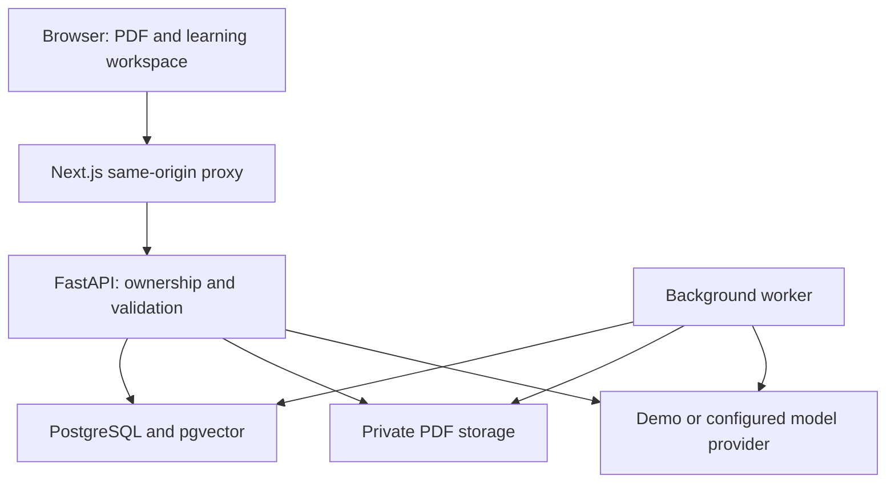

# Architecture

Server-backed features use the Next.js `/api/v1/*` proxy. The proxy forwards requests to a fixed server-side `API_INTERNAL_URL`; it does not take arbitrary upstream URLs from the user. File conversion is a separate browser-local path: input bytes are not submitted to this proxy or a third-party converter.

## Interface language

The initial server-rendered interface is Simplified Chinese (`zh-CN`). Settings offers Chinese and English without changing routes or mounting a new application tree. `LocaleProvider` subscribes to a small external store using React's `useSyncExternalStore`; the preference is saved under `studypilot:locale` in browser localStorage. Unknown values fall back to Chinese. Storage failures retain a per-visit choice, and storage events synchronize open tabs.

Chinese interface copy is the lookup key in `apps/web/src/lib/translations.ts`; English copy and parameterized labels live in the same dictionary. React text rendering escapes inserted values. Stable API enums, model identifiers, PDF text, document titles, citations and stored learning content are never used as translation keys. Common structured errors are localized at presentation time, so one cached API error can be displayed in either language. Dates use the active locale; the document's language attribute and browser title follow the preference after hydration.

The setting does not request document translation or change the provider configuration. It does not remount form components, mutate learning data or reissue AI-generation requests. Preference/store unit tests and static React rendering checks are distinct from the prepared browser interaction tests.

## Translation

The reader's Translation tab posts one page at a time to `/documents/{id}/translate`. The API verifies workspace ownership, checks page readiness, retrieves authoritative page text and sends it with terminology preferences to the existing JSON-compatible chat provider. It never uses embeddings. If parsing completed but indexing subsequently failed, the original reader and translation remain accessible without treating partially generated learning material as ready.

Each page is split into exact source slices of at most 1600 characters, bounded by an 18000-character page limit. Segment IDs must be returned once each in their original order; missing, repeated, extra or blank structured results are rejected. Source text is always copied from the stored page, never accepted from a provider response. These checks establish structure and provenance, not semantic translation accuracy. The translation task requests its explicitly chosen output language independently of interface locale.

The client sends at most ten pages sequentially per batch after explicit confirmation. Stopping prevents future page requests but does not recall an in-flight model request or its cost. Completed pages are cached only in component memory under page/target/style/glossary keys and can be exported as bilingual TXT. Switching study tabs retains the mounted translation component; leaving the document or refreshing discards its cache. No database migration or persistent translation storage was added. A process-local two-slot semaphore bounds concurrent translation calls; it is not a distributed quota system.

## Local conversion

`/app/tools` lazily loads pdf-lib and fflate for file creation/ZIP packaging and reuses the self-hosted PDF.js assets for PDF rendering/text extraction. Canvas handles image encoding and applies white backgrounds for JPEG. Images are fitted to A4 or their own aspect ratio, not stretched. ZIP members use bounded, sanitized, numbered names to prevent collisions and path traversal.

Files are extension/size checked; supported image signatures and dimensions are checked before decoding. Batches are limited to 20 images or one PDF (300 pages maximum), 20 MB per file, 50 MB total input, 100 MB output and 24 million decoded pixels per image/page. PDF image exports are limited to 20 selected pages and rendered sequentially, releasing canvases/pages afterward. Abort requests interrupt between steps and destroy active PDF tasks. These limits reduce resource use but do not make malicious file decoding a hardened sandbox.

No conversion upload endpoint exists. Browser-local conversion does not imply that AI translation is local: that depends on the configured model endpoint. Metadata, color profiles and animation are not preserved; OCR, office-document layout conversion and translated-PDF layout reconstruction are outside the implemented scope.

## Document lifecycle

Uploads create a queued document. The worker claims jobs, extracts page text with pypdf, creates page-bounded overlapping chunks, generates embeddings, and stores grounded knowledge points. Progress is committed during processing. Failures remain visible and can be retried. Ordinary uploads in demo mode retain reading/search capabilities without simulated AI knowledge.

Documents move through `queued → parsing → indexing → ready`, with `failed` as a retryable terminal state. A stale processing timeout protects against abandoned jobs, but this is not a production-grade distributed job queue.

## Retrieval and citations

An embedding signature records the provider, endpoint and embedding model. A mismatch requires reindexing. Retrieval filters by document ID before cosine-distance ranking. Answer source IDs are checked against retrieved chunks; citation page numbers come from stored document chunks rather than trusting model-provided page numbers.

The demo embedding is a deterministic hashing feature vector, not a semantic language model. Its answers are explicitly labelled source excerpts.

## Learning state

Knowledge points feed study plans, flashcards and quizzes. Plans reserve daily capacity and schedule later reviews. Flashcards store ease, interval, review count and next due date. Quiz answers stay server-side until submission; short answers use transparent keyword matching, not expert grading.

## Development vs production

PGlite provides PostgreSQL-compatible local persistence with a pgvector extension. Its socket multiplexes connections and is not a substitute for validating native PostgreSQL concurrency. The initial migration currently builds from SQLAlchemy metadata; freeze immutable migration definitions before a stable production release.

The repository deliberately has no payment system, OAuth sign-in, organization management, OCR or multi-document chat in this preview.
