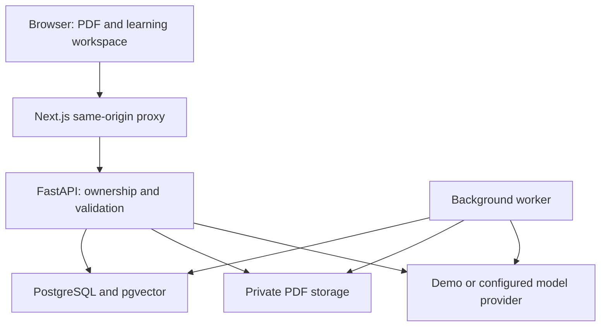

# Architecture

The browser talks only to the Next.js `/api/v1/*` proxy. The proxy forwards requests to a fixed server-side `API_INTERNAL_URL`; it does not take arbitrary upstream URLs from the user.

## Document lifecycle

Uploads create a queued document. The worker claims jobs, extracts page text with pypdf, creates page-bounded overlapping chunks, generates embeddings, and stores grounded knowledge points. Progress is committed during processing. Failures remain visible and can be retried. Ordinary uploads in demo mode retain reading/search capabilities without simulated AI knowledge.

Documents move through `queued → parsing → indexing → ready`, with `failed` as a retryable terminal state. A stale processing timeout protects against abandoned jobs, but this is not a production-grade distributed job queue.

## Retrieval and citations

An embedding signature records the provider, endpoint and embedding model. A mismatch requires reindexing. Retrieval filters by document ID before cosine-distance ranking. Answer source IDs are checked against retrieved chunks; citation page numbers come from stored document chunks rather than trusting model-provided page numbers.

The demo embedding is a deterministic hashing feature vector, not a semantic language model. Its answers are explicitly labelled source excerpts.

## Learning state

Knowledge points feed study plans, flashcards and quizzes. Plans reserve daily capacity and schedule later reviews. Flashcards store ease, interval, review count and next due date. Quiz answers stay server-side until submission; short answers use transparent keyword matching, not expert grading.

## Development vs production

PGlite provides PostgreSQL-compatible local persistence with a pgvector extension. Its socket multiplexes connections and is not a substitute for validating native PostgreSQL concurrency. The initial migration currently builds from SQLAlchemy metadata; freeze immutable migration definitions before a stable production release.

The repository deliberately has no payment system, OAuth sign-in, organization management, OCR or multi-document chat in this preview.
